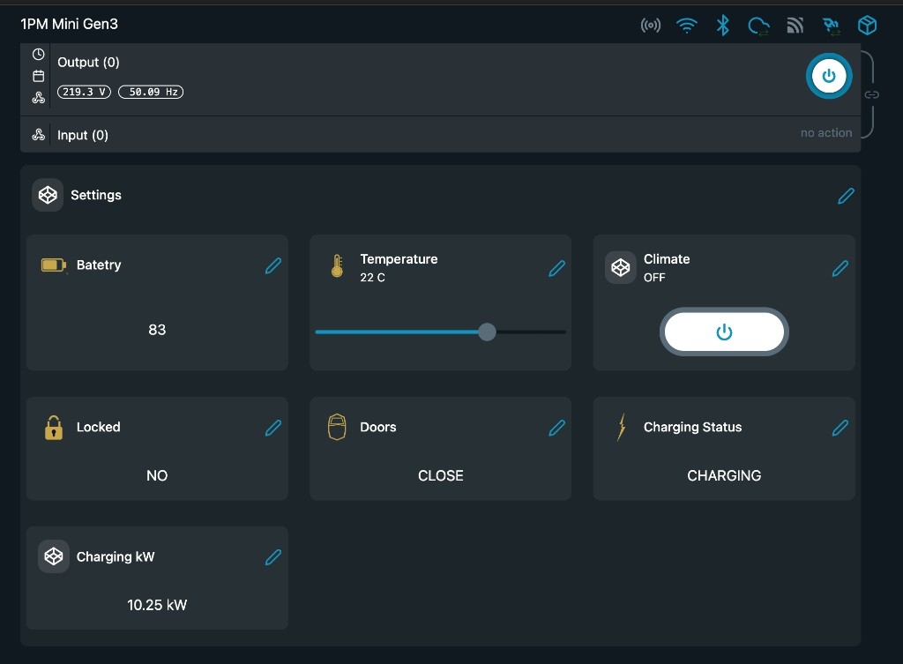

# Porsche EV — Shelly Direct

> **No server. No maintenance. Set it once — runs forever.**

Connect your Porsche Taycan, Macan EV or Panamera PHEV directly to Shelly virtual components using the Porsche Connect API. No cloud service, no Docker, no subscriptions — just a one-time token setup and a Shelly script that handles everything autonomously.

> ⚠️ Uses the unofficial Porsche Connect API. An active **Porsche Connect** subscription is required.

---

## How it works

```
Step 1 (once):  Visit the token page → enter Porsche credentials → copy token
Step 2 (once):  Paste token + VIN into Shelly script → Start

Forever:        Shelly renews its own token every 50 min
                Shelly polls Porsche API every 10 min
                Virtual components update automatically
```

The OAuth2 refresh token **never expires** as long as Shelly is running — it automatically rotates the token on every renewal cycle.

---

## Screenshots

### Shelly App — Mobile


### Shelly Components — Web UI


---

## What you get

| Shelly Component | Data | Notes |
|---|---|---|
| `number:200` Battery % | State of charge | Updates every 10 min |
| `number:201` Climate temp °C | Target temperature | Slider 10–30°C |
| `number:202` Charging kW | Active charging power | 0 when not charging |
| `boolean:200` Climate | On/Off toggle | **Tap to start/stop climate** |
| `boolean:201` Locked | Lock status | Read-only |
| `boolean:202` Doors | All closed? | Read-only |
| `boolean:203` Charging | Power flowing? | True when kW > 0 |

---

## Setup — 3 steps

### Step 1 — Get your token

**Option A — Online (easiest, no Python needed):**

Visit **[mitko.shelly.link:8060/simple](https://mitko.shelly.link:8060/simple)** → enter your My Porsche credentials → copy the two values shown.

> Your credentials are used only for the login request and are **not stored** anywhere.

**Option B — Local Python script:**

```bash
pip install pyporscheconnectapi
python get_token.py
```

Both options output the same two values:

```javascript
var VIN           = "WP0ZZZY15SSA59196";
var REFRESH_TOKEN = "eyJhbGciOiJSUzI1NiIs...";
```

---

### Step 2 — Create Shelly virtual components

In your Shelly web UI → **Components** → **Add virtual component**:

| Type | ID | Label | View |
|---|---|---|---|
| Number | 200 | Battery % | label |
| Number | 201 | Climate temp °C | slider — min: 10, max: 30 |
| Number | 202 | Charging kW | label |
| Boolean | 200 | Climate | **toggle** |
| Boolean | 201 | Locked | label |
| Boolean | 202 | Doors | label |
| Boolean | 203 | Charging | label |

---

### Step 3 — Install the Shelly script

1. Shelly web UI → **Scripts** → **Create script**
2. Name it: `Porsche Direct`
3. Paste the contents of [`shelly_direct.js`](./shelly_direct.js)
4. Edit the top 2 lines:

```javascript
var REFRESH_TOKEN = "eyJhbGciOi...";   // ← from Step 1
var VIN           = "WP0ZZZY1XXXXXXX"; // ← from Step 1
```

5. **Save** → **Start**

---

## Verify it's working

Open the Shelly script console — you should see:

```
[Porsche] Direct script started. VIN=WP0ZZZY... poll=10min
[Porsche] Token OK, expires in 3600s
[Porsche] Polling...
[Porsche] Battery: 86%
[Porsche] Climate: false
[Porsche] Locked: true
[Porsche] Doors closed: true
[Porsche] Charging: 10.25 kW
```

Open the Shelly app on your phone — your car appears as a virtual device:


---

## Climate control

Toggle `boolean:200` in the Shelly app to start or stop remote climatisation.

1. Set the desired temperature with `number:201` (10–30°C)
2. Tap the **Climate** toggle → `Pending...`
3. Car confirms → `Started ✓`
4. Tap again to stop → `Stopping...` → `OFF`

The script polls every 5 seconds after a command until the car confirms — typically 10–30 seconds.

---

## Why this works without a server

| Step | Who handles it |
|---|---|
| Get initial token | You (once, via token page or Python script) |
| Refresh access token (hourly) | **Shelly** — POST to Porsche OAuth endpoint |
| Rotate refresh token | **Shelly** — saves new token to KVS on every refresh |
| Poll vehicle data | **Shelly** — GET to Porsche API every 10 min |
| Climate commands | **Shelly** — POST to Porsche commands endpoint |

Shelly stores the refresh token in its **KVS (Key-Value Store)** — persistent flash storage that survives reboots.

---

## Automations you can build

With Porsche data in Shelly, use the **Shelly app → Scenes** to automate:

| Trigger | Action | Example |
|---|---|---|
| `boolean:203` Charging = ON | Turn off boiler / dryer | Stay within power limit |
| `number:200` Battery = 80% | Send push notification | "Car is charged!" |
| Time schedule | Toggle Climate = ON | Preheat every weekday at 7:45 |
| Solar production > X | Notification | "Good time to charge" |

---

## Supported vehicles

Any vehicle with an active **Porsche Connect** subscription:

| Model | From year |
|---|---|
| Taycan (all variants) | 2019 |
| Macan EV | 2024 |
| Panamera (PHEV) | 2021 |
| Cayenne (E-Hybrid) | 2017 |
| 911 | 992 (2019) |
| Boxster / Cayman 718 | 2016 |

Check [connect-store.porsche.com](https://connect-store.porsche.com) to confirm your model.

---

## Troubleshooting

**`Token refresh failed: 403`**
→ Refresh token expired (30+ days unused, or Porsche password changed).
→ Visit the token page again to get a new token, update the script.

**`GET failed (401)`**
→ Access token expired mid-cycle. The script will auto-recover on the next 50-min refresh.

**`ERROR: Check your REFRESH_TOKEN!`**
→ You forgot to replace `PASTE_REFRESH_TOKEN_HERE` in the script.

**Climate toggle does nothing**
→ Your Shelly firmware must be ≥ 1.1.0 for virtual components + `.on("change")` events.
→ Check script console for `[Porsche] Skip script-triggered climate event` — if this appears constantly, there may be a timing issue with `_climateUpdating` flag.

---

## Requirements

- Shelly **Pro** or **Gen2+** device (1PM Mini Gen3, Pro 4PM, Plus 1, etc.)
- Shelly firmware **≥ 1.1.0**
- Active **Porsche Connect** subscription

---

## vs. Full version

Need a web dashboard with battery gauge, history and a visual interface?
→ See [porsche-ev-shelly-connector](https://github.com/kmetabg/porsche-ev-shelly-connector) (requires Render.com or Docker).


---

## Credits

- [pyporscheconnectapi](https://github.com/CJNE/pyporscheconnectapi) by Johan Isaksson
- Porsche Connect API reverse-engineered by the open-source community

---

**Not affiliated with Porsche AG. Use at your own risk.**
